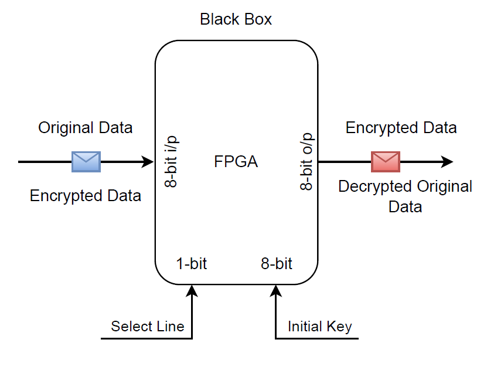
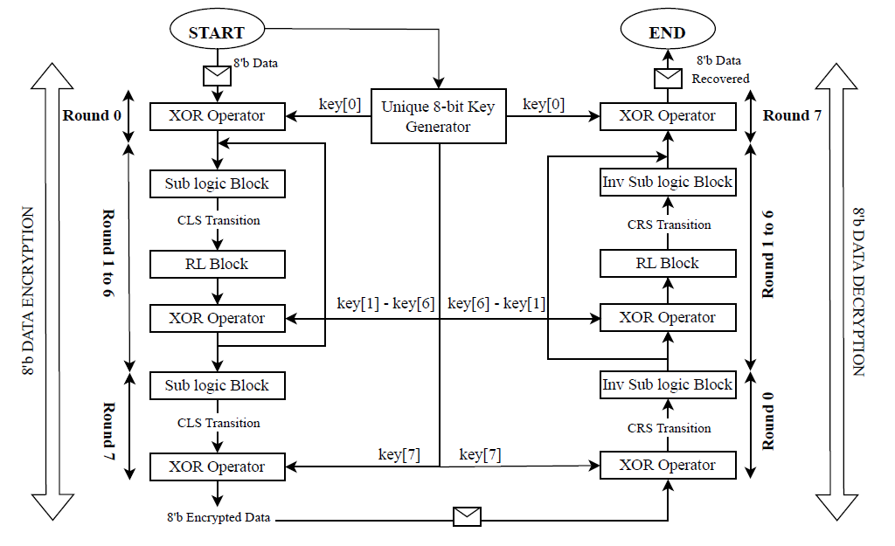
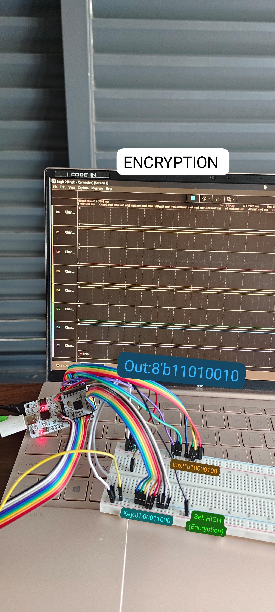
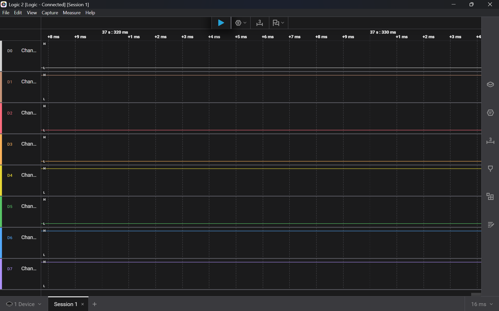
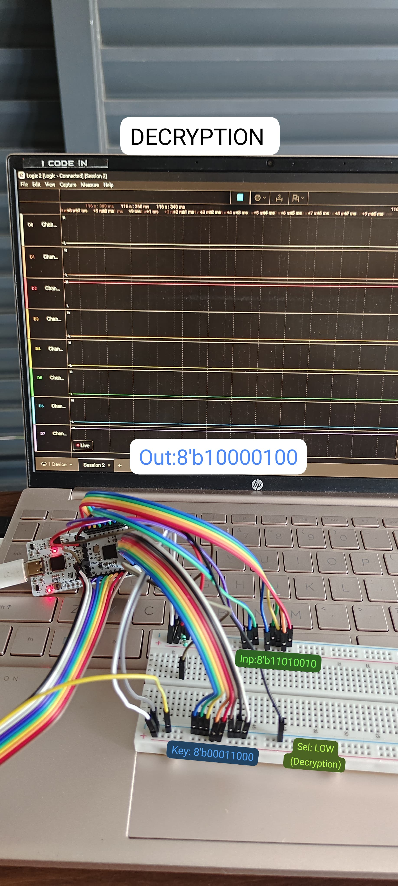
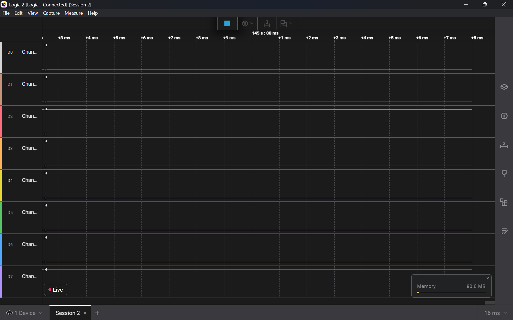

# Design-Implementation-of-an-8-bit-Cryptosystem-using-VSDSquadron-FPGA-Mini
1. Theme:Cryptographic Hardware Engines
2. Idea:The main purpose of this project is to Design and Implement an 8-bit Cryptosystem using VSDSquadron FPGA Mini.
3. Target output:A select line is used to multiplex the system to perform Encryption or Decryption operation as shown in the block Diagram and an initial key is required to encrypt or decrypt the data.

## Block Diagram

## Flowchart

## Verilog modules
| Sl No | Module Name               | Description                                           |
|:------|:--------------------------|:-----------------------------------------------------|
| 01    | top                       | Main logic code                                       |
| 02    | bitwise_xor               | Performs bitwise XOR operation                        |
| 03    | substitution_block        | Similar to S-box used in AES cryptography             |
| 04    | inverse_substitution_block| Inverse S-box                                         |
| 05    | reversible_block          | Performs 8-bit reversal operation                     |
| 06    | circular_right_shift(CRS) | Performs circular right shift operation               |
| 07    | circular_left_shift(CLS)  | Performs circular left shift operation                |

## Working Operation
| Sl No | Port Name | State | Operation                         |
|:------|:----------|:------|:---------------------------------|
| 01    | Sel       | HIGH  | Encryption Operation is performed |
| 02    | Sel       | LOW   | Decryption Operation is performed |

## I/O Interface Specifications
| Sl No | Pin No                            | Description             |
|:------|:----------------------------------|:---------------------  |
| 01    | 13                                | Select line             |
| 02    | [2, 3, 4, 6, 9, 10, 11, 12]       | Data input pins         |
| 03    | [37, 36, 35, 34, 32, 31, 28, 27]  | Data output pins        |
| 04    | [38, 42, 43, 44, 45, 46, 47, 48]  | Initial Key (Secret key)|

## RTL Schematic

## Simulation Results (Vivado)

## Hardware Implementation
### Encryption                                     
   

### Logic Analyzer
 

### Decryption                                     
   

### Logic Analyzer
 
